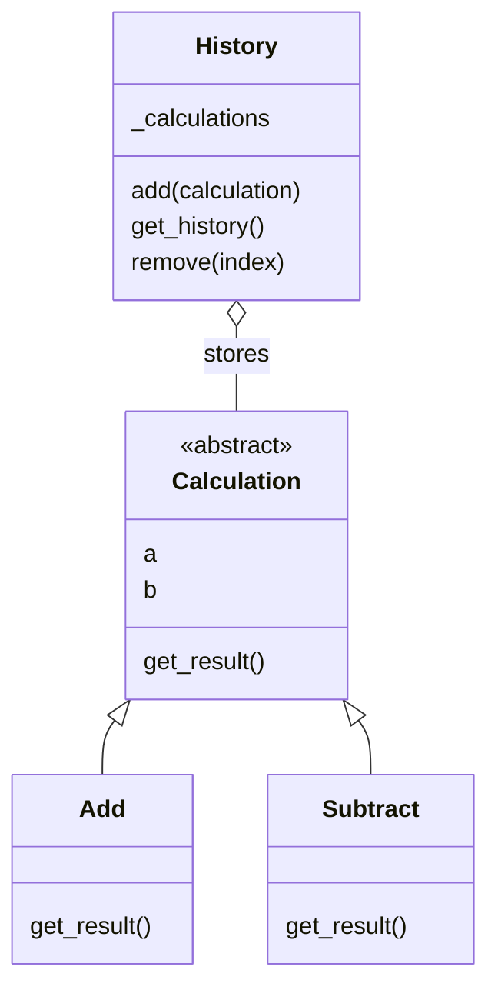

# OOP Calculator CLI

[](https://github.com/kaw393939/is218-oop-calculator/actions/workflows/tests.yml)


An IS218 assignment demonstrating object-oriented programming through an interactive terminal calculator. Add and subtract numbers, inspect a history of calculation objects, and remove individual entries—all backed by automated tests.

**The central lesson:** coverage tells you where to look; assertions tell you whether the behavior is correct. Use coverage throughout development, not just before submission.

## Get started

Requires **Python 3.11 or newer** and Git. The calculator itself uses only the Python standard library; pytest and pytest-cov are development dependencies.

```bash
git clone https://github.com/kaw393939/is218-oop-calculator.git
cd is218-oop-calculator
python3 -m venv .venv
source .venv/bin/activate
python -m pip install -r requirements.txt
python -m calculator
```

On Windows, create the environment with `py -m venv .venv` and activate it in PowerShell with `.venv\Scripts\Activate.ps1`. Run all commands from the repository root.

## Commands

| Command | What it does |
| --- | --- |
| `add` | Prompt for two numbers, add them, and save the calculation. |
| `subtract` | Subtract the second number from the first and save the calculation. |
| `history` | Display numbered calculations and their results. |
| `remove` | Show history and remove an entry by its displayed number. |
| `help` | List available commands. |
| `exit` | End the session. |

Commands ignore capitalization and surrounding whitespace. Negative numbers, decimals, and scientific notation are supported. History exists in memory for the current session and resets when the program closes.

### Example session

```text
OOP Calculator

Type "help" for commands.
> add
First number: 10
Second number: 5
Result: 15
> subtract
First number: 20
Second number: 7
Result: 13
> add
First number: 100
Second number: 50
Result: 150
> history
Calculation History

1. Add: 10, 5 = 15
2. Subtract: 20, 7 = 13
3. Add: 100, 50 = 150
> remove
Calculation History

1. Add: 10, 5 = 15
2. Subtract: 20, 7 = 13
3. Add: 100, 50 = 150
Enter calculation number to remove: 2
Removed: Subtract: 20, 7 = 13
> history
Calculation History

1. Add: 10, 5 = 15
2. Add: 100, 50 = 150
> exit
Goodbye!
```

Invalid commands, nonnumeric input, nonfinite numbers, overflowed results, empty history, and invalid removal numbers receive helpful messages. A failed calculation never enters history. Ctrl+C and end-of-input exit cleanly, including during an operand or removal prompt.

## OOP design



| Concept | Implementation |
| --- | --- |
| **Abstraction** | `Calculation` uses `ABC` and `@abstractmethod` to require `get_result()`. It cannot be instantiated directly. |
| **Inheritance** | `Add` and `Subtract` inherit the two operands and implement their own arithmetic. Both **are calculations**. |
| **Polymorphism** | History display calls `get_result()` on either subclass through the same interface, without branching on its type. |
| **Encapsulation** | `History` owns its internal list. The CLI uses its methods; `get_history()` returns a copy of the list. |
| **Collections of objects** | History stores the calculation objects, preserving their operands and operation types. |
| **REPL** | `run()` repeatedly reads a command, evaluates it, prints feedback, and returns to the prompt. |

For example, a caller can treat different operations uniformly:

```python
from calculator.calculation import Add, Subtract

calculations = [Add(10, 5), Subtract(20, 7), Add(100, 50)]
results = [calculation.get_result() for calculation in calculations]
assert results == [15, 13, 150]
```

### User numbers versus Python indexes

The CLI displays entries starting at **1**. `History.remove(index)` accepts a Python index starting at **0**, so the CLI passes `number - 1`. Negative and out-of-range indexes raise `IndexError`; the CLI catches that error and keeps running. This prevents entering `0` from accidentally removing the last item.

Calculations use Python floating-point arithmetic. Display uses compact numeric formatting, so whole-number results appear as `15` instead of `15.0`. Decimal arithmetic can have the usual floating-point rounding differences; this is a teaching calculator, not an exact-decimal accounting tool.

## Testing and the coverage feedback loop

Run the full suite:

```bash
python -m pytest
```

`pytest.ini` automatically enables **line and branch coverage**, shows missing lines, and requires **100% coverage**. A test failure or coverage below that threshold produces a failing exit status. Application files, including the module entry point, are measured without custom coverage exclusions.

To spell out the coverage command explicitly:

```bash
python -m pytest --cov=calculator --cov-branch --cov-report=term-missing
```

To create a browsable report:

```bash
python -m pytest --cov-report=term-missing --cov-report=html
```

Open `htmlcov/index.html` in your browser. Generated reports and the virtual environment are ignored by Git.

### Use missing coverage to decide what to test next

1. Implement a small behavior and write tests that assert its result.
2. Run the tests and inspect the missing-line and branch report.
3. Open the uncovered code and ask which user behavior would reach it.
4. Add a test for that behavior, including the expected output or state change.
5. Fix the application if the new test exposes a defect, then rerun the suite.

For example, if the invalid-index branch in `History.remove()` is uncovered, test an empty history, a negative index, and an index past the end. Assert that `IndexError` is raised **and that existing history remains unchanged**. At the CLI level, assert that the error is explained and subsequent commands still work.

During an unfinished development step, you can inspect coverage without enforcing the final threshold:

```bash
python -m pytest --cov-fail-under=0
```

Return to the default command before submission. **100% coverage proves execution, not correctness.** Meaningful assertions, boundary cases, and review still matter.

### What the suite verifies

| Area | Behaviors checked |
| --- | --- |
| Calculations | Addition, subtraction, positive and negative operands, zero, decimals, abstract-class enforcement, polymorphism. |
| History | Empty state, mixed calculation types, ordering, defensive list copies, independent instances, first/middle/last removal, invalid indexes, invalid object types. |
| CLI | Complete assignment session, every command, help, normalized commands, unknown commands, empty history, invalid input, invalid removal, continued use after errors. |
| Reliability | NaN/infinity rejection, overflow rejection, Ctrl+C/EOF at each input stage, and the `python -m calculator` entry point. |

GitHub Actions runs the same coverage-enforced suite on **Python 3.11, 3.12, 3.13, and 3.14** for pushes and pull requests. The status badge links to live results.

## Project layout

```text
.
├── calculator/
│   ├── __init__.py
│   ├── __main__.py          # python -m calculator entry point
│   ├── calculation.py       # Calculation, Add, Subtract
│   ├── history.py           # Encapsulated collection
│   └── cli.py               # Interactive REPL
├── tests/
│   ├── test_calculation.py
│   ├── test_history.py
│   └── test_cli.py
├── .github/workflows/tests.yml
├── .gitignore
├── pytest.ini
├── requirements.txt
└── README.md
```

## Assignment completion checklist

- [x] Abstract `Calculation` with two operands and `get_result()`.
- [x] Concrete `Add` and `Subtract` subclasses.
- [x] Polymorphic use of calculation objects.
- [x] Encapsulated history with add, retrieve, and remove methods.
- [x] Numbered history and safe conversion from user numbers to Python indexes.
- [x] REPL supporting all six required commands.
- [x] Friendly handling of invalid input and empty history.
- [x] Automated arithmetic, history, polymorphism, and CLI tests.
- [x] Coverage integrated into the development loop with a 100% requirement.
- [x] Reproducible setup instructions and automated GitHub checks.
