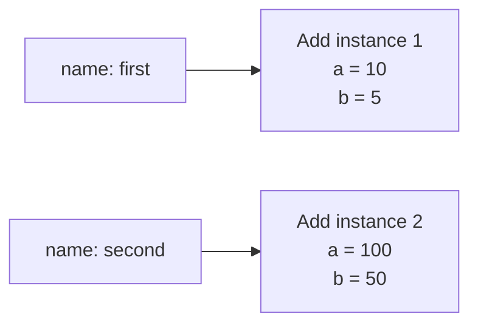

# Stage 1: an object you can ask for an answer

[Course home](https://github.com/kaw393939/is218-oop-calculator) · [Worked branch](https://github.com/kaw393939/is218-oop-calculator/tree/learn/01-objects) · [Next lesson](https://github.com/kaw393939/is218-oop-calculator/blob/learn/02-abstraction/docs/lessons/02-abstraction.md)

## Why this matters

When checking game scores, a bare total such as `15` loses the inputs that produced it. An `Add(10, 5)` object keeps its two inputs together and knows how to calculate an answer. Two functions could perform the arithmetic; objects let us practice putting related state and behavior together.

## What you already have

Complete [setup](https://github.com/kaw393939/is218-oop-calculator/blob/main/docs/setup.md). You have an empty package folder, a tests folder, a virtual environment, and test tools. There is no abstract parent or CLI yet.

## What you will add

By the end, you can distinguish a class from an instance, explain `self`, inspect attributes, call a method, and write an assertion about its result.

Type these files in order from the worked branch:

1. `calculator/__init__.py`: marks a regular Python package; importing it does not run an application.
2. `calculator/calculation.py`: one concrete `Add` class.
3. `tests/test_calculation.py`: four direct examples of expected behavior.

## Type and run

First type the class. `__init__` initializes an object after creation. For `Add(10, 5)`, `self` refers to that new instance; `self.a = a` stores `10` on it. `get_result` is a method that reads this instance's operands.

Open Python by typing `python` in the terminal, then enter:

```python
from calculator.calculation import Add
first = Add(10, 5)
second = Add(100, 50)
print(first.a, first.b)
print(first.get_result())
print(second.get_result())
```

**Expect:** `10 5`, then `15`, then `150`. `Add` is the class. `first` and `second` refer to different instances. Exit with `exit()`.

Now type the import at the top of `tests/test_calculation.py` and only its first test. Its three lines arrange an example, act through a method, and assert an expected answer. In the terminal:

```bash
python -m pytest tests/test_calculation.py
```

One test should pass. Type the remaining tests, then run `python -m pytest`. The completed stage has four passing cases. There is no coverage threshold yet.

### See two independent instances



`Add` describes the kind of object. The boxes are two actual objects, each with its own attributes. During `first.get_result()`, `self` refers to the first box. During `second.get_result()`, it refers to the second.

For `self.a = a`, read the left side as **this object's attribute** and the right side as **the argument received by the method**. Both are named `a`, but they play different roles.

## Explain and experiment

Predict what happens if you change the first test's expected answer to `16`. Run it, inspect the difference between expected and actual values, then restore `15`. A test that calls a method without checking the answer would miss that mistake.

Open a fresh Python prompt and repeat the earlier snippet to recreate `first` and `second`. Then set `first.a = 20` and ask both objects for results again. Predict which one changes. This is an experiment with mutable state, not a new application requirement.

### Build something independently

Choose a positive and a negative operand not used in the worked tests. Write a new test that checks the result **and** verifies that asking for it did not change either operand. Predict the result yourself; no worked implementation is supplied. Keep this test as you move forward.

Your total may now exceed the reference's four tests. That is expected: checkpoint counts describe the unextended reference, not a grading target.

## Check your understanding

1. How does `self` identify which object's numbers to use?
2. What is the difference between `first.get_result` and `first.get_result()`?
3. Why should the second object's operands stay unchanged?

<details>
<summary>Self-check after you explain</summary>

Python supplies the receiving instance as `self` when calling a bound method. Without parentheses, you refer to the method; parentheses call it. Each instance has its own operand attributes, so modifying the first object's attribute does not modify the second object's attribute.

</details>

**Ready to move on:** all four tests pass, the deliberately broken test is restored, and you can trace one instance without reading the comments aloud. Commit your work with `git add calculator tests` and `git commit -m "Stage 1: model addition as an object"`.
