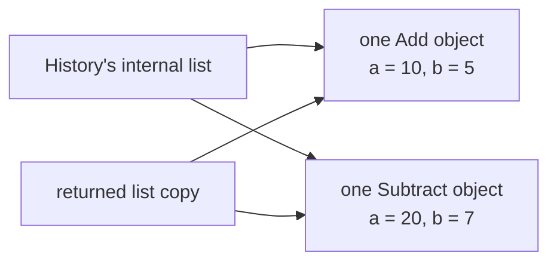

# Stage 3: give one object responsibility for history

[Previous lesson](https://github.com/kaw393939/is218-oop-calculator/blob/learn/02-abstraction/docs/lessons/02-abstraction.md) · [Worked branch](https://github.com/kaw393939/is218-oop-calculator/tree/learn/03-history) · [Next lesson](https://github.com/kaw393939/is218-oop-calculator/blob/learn/04-repl/docs/lessons/04-repl.md)

## Why this matters

A scratchpad needs more than arithmetic: it must retain entries and remove the correct one. If every caller edits a shared list directly, the rules for managing that list can become scattered. History gives those rules one home.

## What you already have

Two interchangeable calculation types and eight passing tests. History will store the actual objects, not just their results or formatted strings.

## What you will add

You will explain a HAS relationship, manage a collection through methods, protect list membership with a copy, and test removal boundaries.

Add these files from the worked branch:

1. `calculator/history.py`: `add`, `get_history`, and `remove`.
2. `tests/test_history.py`: seven focused collection examples.

[Compare with Stage 2](https://github.com/kaw393939/is218-oop-calculator/compare/learn/02-abstraction...learn/03-history).

## Type and run

Type the initializer, `add`, and `get_history` first. Each new History gets its own list. The leading underscore in `_calculations` signals internal use by convention; it is not a security boundary. `list[Calculation]` documents the intended element type, while `isinstance` performs an actual runtime check.

Open Python and type:

```python
from calculator.calculation import Add, Subtract
from calculator.history import History
history = History()
history.add(Add(10, 5))
history.add(Subtract(20, 7))
print(len(history.get_history()))
snapshot = history.get_history()
snapshot.clear()
print(len(history.get_history()))
```

**Expect:** `2`, then `2`. You cleared a different list. The copy is shallow: it refers to the same calculation objects, so it does not make their operands immutable.

### A new list can contain the same objects



The two list boxes are distinct, but their arrows point to the same calculation objects. Clearing the returned list removes its arrows, not the internal list's arrows.

In the same Python session, get a fresh copy after the earlier clear:

```python
snapshot = history.get_history()
snapshot[0].a = 99
print(history.get_history()[0].get_result())
```

**Predict first, then expect `104`.** Mutating the shared Add object changes what both lists can observe. Restore `snapshot[0].a = 10` before continuing. A shallow copy protects collection membership; it does not freeze object state.

Exit Python, type `remove` and its tests, then open a fresh Python prompt and recreate the history above. `history.remove(0).get_result()` returns `15`; one entry remains. `remove(-1)` raises `IndexError` because this API intentionally rejects negative indexes.

Exit Python and run `python -m pytest`. Expect 15 passing tests across calculations and history.

## Explain and experiment

Before running the invalid-removal test, predict both outcomes: an exception is raised and existing entries remain unchanged. A failure path should not corrupt the successful work that preceded it.

Temporarily return the internal list instead of a copy. Run the tests, identify the failed ownership check, then restore `.copy()`.

### Build something independently

Write a test for `remove(0)` on a brand-new empty History. Assert both the expected exception and the empty state afterward. Keep it; a later worked stage may include a similar case, so merge equivalent tests rather than losing your assertions.

## Check your understanding

1. Why is History not a subclass of Calculation?
2. What does `pop(index)` return as well as remove?
3. Which part of the data does the shallow copy protect?

<details>
<summary>Self-check after you explain</summary>

History manages calculations; it is not one arithmetic operation and cannot substitute for one. `pop` returns the removed object. The new list protects the internal collection's membership from direct edits through the returned list; the contained objects are still shared.

</details>

**Ready to move on:** 15 tests pass; show a successful and a rejected removal. Commit with `git add calculator tests` and `git commit -m "Stage 3: encapsulate calculation history"`.
